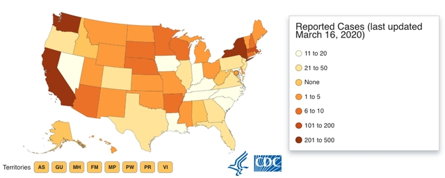
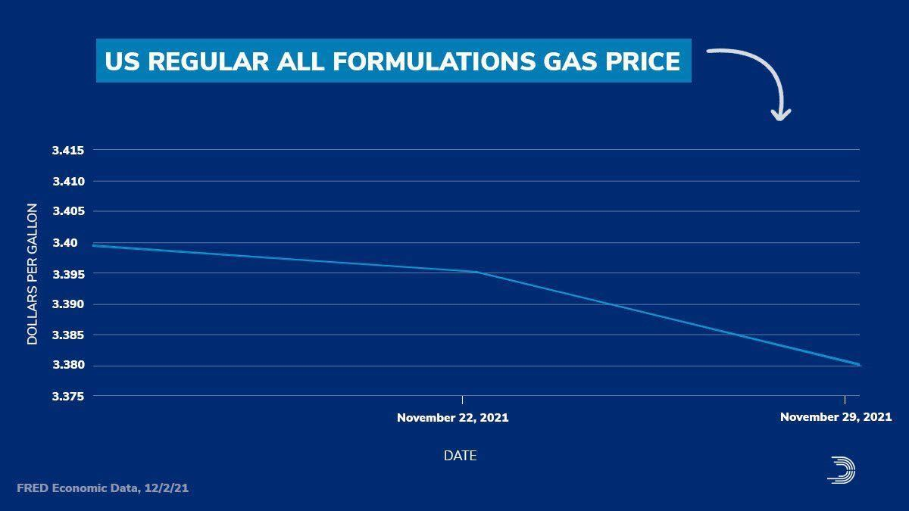
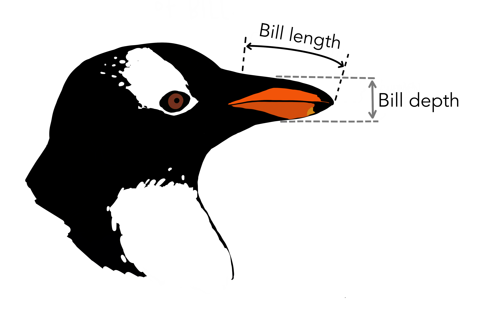
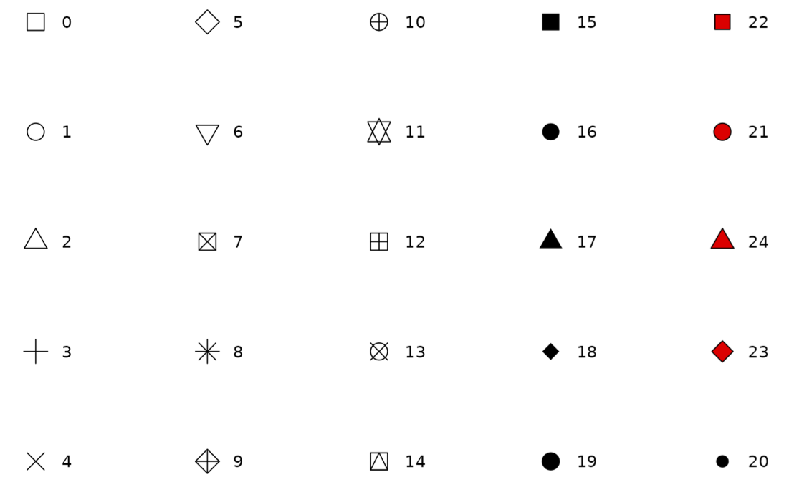

# (PART\*) Visualizations {-}

# Intro to ggplot2

```{r setup, include=FALSE}
knitr::opts_chunk$set(strip.white = TRUE)
```

```{r message=FALSE}
library(tidyverse)
library(palmerpenguins)
```

<a href="Exercise_Viz1.Rmd" download>Exercise Sheet</a>

> "The greatest value of a picture is when it forces us to notice what we never expected to see."<br>— John Tukey

>"There is no single statistical tool that is as powerful as a well‐chosen graph." (Chambers et al. 1983)

<span style="font-size:14.0pt"><b><u>Why Do We Care About Visualizing Our Data?</u></b></span>

Consider the following scenario:

I tell you that I have two different datasets. Each dataset is comprised of individuals measured on two outcomes (say height and weight). The mean and standard deviation of height and of weight are the same in both datasets. The correlation between height and weight is the same in both datasets as well. By every statistical metric, these datasets are the same. So, they must ***look*** similar, right?

Click the button below:

<button class="btn btn-primary" data-toggle="collapse" data-target="#BlockName"> Show/Hide </button>  
<div id="BlockName" class="collapse">  

```{r out.width = "100%", echo=FALSE}
knitr::include_graphics(c("figures/DinoSequential.gif"))
```

```{r out.width = "100%", echo=FALSE}
knitr::include_graphics(c("figures/datasaurus_dozen.jpeg"))
```
</div>
<br>

This collection of data is called the [datasauRus](https://github.com/jumpingrivers/datasauRus), and more information about how these were generated can be found in  [this](https://www.autodesk.com/research/publications/same-stats-different-graphs) technical paper. This is a modern version of the famous Anscombe's Quartet:

{Width=100%}

All four of these datasets have matching n's, means, standard deviations, and correlations. This means that the slope and intercept, and corresponding statistical tests, will all be equivalent. The data **clearly** look different though. (These data are built into R in an object called `anscombe`, which you can look at to test this for yourself!)

The key point here is that the summary statistics of some variables and their linear relationships inherently overlook some aspects of the data. This highlights the critical importance of visualizing your data, and not just relying on summary statistics alone. The point of a visualization, just like a summary statistic, is to understand a relationship or pattern in your data. However, by looking at the raw data itself, you don't run the risk of missing things the way you do by relying on summary statistics alone.

## When Visualizing Go Wrong

It's easy enough to just say, "Look at your raw data! Create a visualization!" However, a bad visualization is often times worse than no visualization at all. One of the things that the Covid-19 pandemic brought with it originally was a plethora of data visualizations. Below are a few that I came across myself out in the real world:

{width=100%}

{width=100%}

{width=100%}

{width=100%}

So it's not enough to just make *some* visualization. It's important to also consider the principles that make a ***GOOD***. Over the next few lessons, we are going to cover both!

```{r, echo=FALSE,out.width="49%", out.height="20%", fig.cap="caption", fig.show='hold', fig.align='center'}

``` 

## ggplot2

Data visualization is one of the things that sets R apart from other programming languages that can be used for statistics, like Python. R still has the best data visualization capabilities, and it is one of the primary reasons it is used over Python in Social Sciences. This is also one of the first times you will get to see what coding can be all about. You are actually going to be creating stuff today with your code!

In this class, we will use the `ggplot2` package to create visualizations. Graphs are constructed by mapping data to geometric objects (lines, bars, points, etc.) according to some aesthetic attributes (color, shape, size, etc.). `ggplot2` uses this to inform its grammar. We'll explain this much more as we go!
		
{width=100%}
<p style="font-size:6pt">Artwork by @allison_horst</p>

### Meet the Penguins

To create visualizations, we need some data to visualize! I am going to work with the `palmerpenguins` dataset from [Alison Horst](https://allisonhorst.github.io/palmerpenguins/) (Yes, she is someone I admire and think does great work!).

{width=207px}

This dataset contains measurements from 344 different penguins. Measurements include things like bill length and depth, sex, among others.

{width=100%}
<p style="font-size:6pt">Artwork by @allison_horst</p>
<br>

There are 3 different species of penguins in this dataset, collected from 3 islands in the Palmer Archipelago, Antarctica.

{width=100%}
<p style="font-size:6pt">Artwork by @allison_horst</p>

Use the `library(palmerpenguins)` call to load in the dataset.

## A Basic Graph

Let's start building a basic graph. There are going to be <u>**LOTS**<u> of exercise breaks throughout. 

<p class="text-info"> **<u>Note:</u> As we move forward with building our first graph, each new piece of code added will be accompanied by a literate programming portion, where you will describe in words what the code is doing.**</p>

All ggplot graphs are build using the `ggplot()` call. The first thing it needs is some data. We'll use the `%>%` to pass in our `penguins` dataframe. 

```{r}
penguins %>%
  ggplot()
```

> **Start by telling ggplot to use the `penguins` dataframe for our data**

Woo! We got a grey rectangle! Of course, the code above alone will not do anything. We have to tell ggplot what we want to plot. Hmm... Let's see how a penguin's `bill_length_mm` is related to its `flipper_length_mm`. I would imagine that bigger penguins would tend to have longer bills and flippers, but maybe not? That is why we create visualizations, to try and help answer questions we may have about our data (which consist of samples thought to be representative of the world at large)!

We need to tell ggplot what variables from our data should be mapped to the aesthetics we want to render on our graph. We'll do that with the `aes()` call, and start with specifying what to display on each axis.

```{r}
penguins %>%
  ggplot(mapping = aes(y = flipper_length_mm,
                       x = bill_length_mm))
```

>"Start by telling ggplot to use the `penguins` dataframe for our data, **map flipper length to the y-axis and bill length to the x-axis.**"

Above, we specified that we want `flipper_length_mm` on our y-axis, and `bill_length_mm` on our x-axis (it is good practice to specify *y* first and *x* second). All aesthetic mappings must be separated by a comma, and it does not matter the order you list them (though it is good practice to start with the axes first). As you can see, ggplot figured out how to label the axes on its own. 

<div class="panel panel-success">
  <div class="panel-heading">**EXERCISE 1**</div>
  <div class="panel-body">Create your own graph using the `penguins` data and pick 2 of the following to put on your x and y axes: `bill_length_mm`, `bill_depth_mm`, `flipper_length_mm`, or `body_mass_g`.</div>
</div>
<br>
We told ggplot what our aesthetic mappings are (what data source to use), but not what it should render from those mappings! We want ggplot to use those mappings to construct some **geom**etric object, and the way we do that is by adding a *geom*, aptly named. There are a number of different geoms, which have the general syntax of `geom_X()`, where X usually refers to the specific geometric object you want to render. Here, we want a point on our graph for each penguin, so we will use `geom_point()`. 

<p class="text-info"> **<u>Note:</u> There are a TON of different geoms. You will see many more as we go.**</p>

```{r}
penguins %>%
  ggplot(mapping = aes(y = flipper_length_mm,
                       x = bill_length_mm)) +
  geom_point()
```

> "Start by telling ggplot to use the `penguins` dataframe for our data, map flipper length to the y-axis and bill length to the x-axis. **Represent each observation with a point.**"

Okay, **NOW** we are talking! This looks like an actual real graph. Look at your very first ggplot masterpiece! 

There are two important things to note here:

1. We used the `+` instead of `%>%` to add on a new function. The ggplot system is additive/layered, which is a very powerful idea that we will get into more later. For now, it is enough to know that what we are doing was adding the `geom_point()` to our code. We do not want to take the `penguins %>% ggplot(mapping = aes(y = flipper_length_mm, x = bill_length_mm))` code and use it as the argument for our `geom_point()` function, which is what would happen if we used %>% to pipe it! We want to just add the points on top of the existing base that code created, which is why we use the `+`.

2. When running this code, in addition to creating the graph (in the "Plots" section of RStudio or inline under your code), the following showed up in the console: 

<p style="color:#A79BF0"> **Warning message:<br>Removed 2 rows containing missing values (geom_point).**</p>

Looking at your warnings and errors is always important, but especially so when creating visualizations! This says that it removed 2 rows of data, which may not seem like a big deal but we don't want our visualizations to be misleading. Especially when we start visualizing summary statistics (like means). If we look at our actual data though, we can verify that there are two penguins that don't have a measurement value for flipper length or bill length. So obviously without either or both of those, it cannot be included on the graph. In this case, this is okay, but it's important to always verify!

::: {.rmdtip}
<p style="font-size:10pt"><u>**NOTE:**</u> *moving forward, for pedagogical purposes I am going to be hiding this warning message so the output from subsequent code is cleaner. However, those 2 rows are still being removed!*</p>
:::

Above, we mentioned how the goal of a visualization is to understand a relationship, or pattern, in our data. For every visualization we make, we are also going to provide a verbal description of the pattern we see (should one exist!) underneath. This will help develop an intuitive **graph literacy**. Being able to quickly and accurately interpret visualizations is an important skill, and one of the pillars of this course. 

::: {.rmdimportant}
<p style="font-size:10pt">*Things related to graph literacy and comprehension will appear in boxes like this moving forward!*</p>

In the visualization we can see that, generally speaking, penguins with greater flipper length tend to have greater bill length as well. There seems to be a positive linear relationship between bill length and flipper length such that, as flipper length increases, bill length increases in turn.
:::

<p class="text-info"> **<u>Note:</u> We have to use a lot of tentative language and include many qualifiers here. We have not done any formal statistical analyses to state any relationship or effect definitively.**</p>

<div class="panel panel-success">
  <div class="panel-heading">**EXERCISE 2**</div>
  <div class="panel-body">Update your graph above by telling ggplot you want it to render a point for each observation in the penguins dataset. Describe the pattern/relationship you see.</div>
</div>

# Aesthetics

## Color

In looking at the graph created above, it kind of seems like there may be different groups or clusters of penguins in this data. Let's look into this further and consider what variables we have in our data.

One way we can see the penguins grouped is with a cluster at the top and another at the bottom:

```{r echo=FALSE}
penguins %>%
  drop_na() %>%
  ggplot(mapping = aes(y = flipper_length_mm,
                       x = bill_length_mm)) +
  #  ggforce::geom_mark_ellipse(aes(fill = species)) +
  ggforce::geom_mark_ellipse(data = penguins %>%
                               filter(flipper_length_mm < 205),
                             fill = "grey",
                             alpha = 1) +
  ggforce::geom_mark_ellipse(data = penguins %>%
                               filter(flipper_length_mm > 205),
                             fill = "lightgrey",
                             alpha = 0.4) +
  geom_point()

```

This might correspond to the `sex` variable we have! Maybe it's the case that the bigger penguins were males, and the smaller ones were females?

```{r echo=FALSE}
penguins %>%
  drop_na() %>%
  ggplot(mapping = aes(y = flipper_length_mm,
                       x = bill_length_mm)) +
  #  ggforce::geom_mark_ellipse(aes(fill = species)) +
  ggforce::geom_mark_ellipse(data = penguins %>%
                               filter(flipper_length_mm < 205),
                             fill = "lightgreen",
                             alpha = 0.8) +
  ggforce::geom_mark_ellipse(data = penguins %>%
                               filter(flipper_length_mm > 205),
                             fill = "orange",
                             alpha = 0.8) +
  geom_point()
```

We could explore this idea if there was some way to visually indicate which of the observations on our graph were from male penguins and which were from female. Specifically, we want the *color* of the points to different based on the value for that observation's `sex`. So... let's just try to do that! One of the best parts about coding is, you can always just try to run some code and see what happens!

::: {.rmdwarning}
<p style="font-size:10pt">Let's declare this as a formal prediction. We'll specify two mutually exclusive alternatives that we *could* see.</p>

* "If it is the case that the differences in penguin size could be explained by what sex they are (e.g., bigger penguins were males and the smaller ones were females), then all the points in the cluster at the top would be one color and all the points in the cluster at the bottom would be a different color. If it is not the case that the differences in penguin size could be explained by what sex they are, the points in each of the two clusters would not have distinct colors."
:::

```{r warning=FALSE}
penguins %>%
  ggplot(mapping = aes(y = flipper_length_mm,
                       x = bill_length_mm),
         color = sex) +
  geom_point()
```

Uh... okay. So, that didn't work. OH! I remember we said above that we use `aes()` to tell ggplot what variables from our data should be *mapped* to the aesthetics we want to render on our graph. We need to pass color as another argument to the aesthetics of the plot via `aes()`. 

```{r warning=FALSE}
penguins %>%
  ggplot(mapping = aes(y = flipper_length_mm,
                       x = bill_length_mm,
                       color = sex)) +
  geom_point()
```

> "Start by telling ggplot to use the `penguins` dataframe for our data, map flipper length to the y-axis and bill length to the x-axis. Represent each observation with a point, **and map sex to the color of each point.**"

That's more like it! This doesn't really look like what we thought it might though. It is consistent with our possible outcome, where sex does not explain the differences in penguin size. However, after looking at this more carefully, it actually kind of looks like there are 3 distinct clusters, not 2.

```{r echo=FALSE}
penguins %>%
  drop_na() %>%
  ggplot(mapping = aes(y = flipper_length_mm,
                       x = bill_length_mm)) +
    ggforce::geom_mark_ellipse(aes(fill = species)) +
  # geom_mark_ellipse(aes(fill = species,
  #                       label = species),
  #                   expand = unit(0.5,"mm"),
  #                   label.buffer = unit(-5, 'mm'))+
  theme(legend.position = "none")+
  geom_point()
```

This might correspond to the `species` variable we have! Maybe it's the case that different penguin species differ in size? That actually makes a lot more sense. Let's try to test that now.

::: {.rmdwarning}
* "If it is the case that the differences in penguin size could be explained by what species they are, then all the points in each cluster would have distinct colors. If it is not the case that the differences in penguin size could be explained by what species they are, the points in each of the clusters would not have distinct colors."
:::

```{r warning=FALSE}
penguins %>%
  ggplot(mapping = aes(y = flipper_length_mm,
                       x = bill_length_mm,
                       color = species)) +
  geom_point()
```

> "Start by telling ggplot to use the `penguins` dataframe for our data, map flipper length to the y-axis and bill length to the x-axis. Represent each observation with a point, **and map *species* to the color of each point.**"

::: {.rmdimportant}
In the visualization we can see that, generally speaking, penguins with greater flipper length tend to have greater bill length as well. There seems to be a positive linear relationship between bill length and flipper length such that, as flipper length increases, bill length increases in turn. **Additionally, penguins of the same species tend to have similar flipper and bill lengths, which are distinct from other species. Adelie penguins tend to have the shortest lengths, and Gentoo the longest. Chinstrap penguins seem to have shorter flippers but longer bills.**
:::

Hot dang, looks like we might have found a promising explanation for how penguins differ in size! We would obviously need to do some kind of formal statistical analysis to know for sure, but visualizing our actual raw data in ways like this allow us to quickly get answers to different questions we may want to use our data to answer.

<div class="panel panel-success">
  <div class="panel-heading">**EXERCISE 3**</div>
  <div class="panel-body">Think about what patterns you notice in the visualization you created, and test whether `sex` or `species` might explain those patterns. Make a prediction, test that prediction, and then describe what you see.</div>
</div>


### Global vs Local Aesthetics

When we first described our visualization, one of the things we noted was that, *"There seems to be a positive linear relationship between bill length and flipper length such that, as flipper length increases, bill length increases in turn."* Let's add on the line of best fit to actually see the linear relationship. We'll do this by using `geom_smooth()`. We'll set a few arguments within `geom_smooth()`, but you don't have to worry much about those.

Let's copy/paste the code from above and add in our new `geom_smooth()` call. By doing so we should see the best fitting line for all of our data.

```{r warning=FALSE, message=FALSE}
penguins %>%
  ggplot(mapping = aes(y = flipper_length_mm,
                       x = bill_length_mm,
                       color = species)) +
  geom_point() +
  geom_smooth(method = "lm", se = FALSE)
```

>"Start by telling ggplot to use the `penguins` dataframe for our data, map flipper length to the y-axis and bill length to the x-axis. Represent each observation with a point, and map *species* to the color of each point. **Add a line of best fit for our data.**"

Hey, wait, that is not quite what we were expecting... Instead of there being one line for all of our data, it looks like there is a line for each species. What's happening here is highlighting the difference between a **<u>global</u>** aesthetic (those put in the `ggplot()` call and apply to ALL added parts of our graph) and a **<u>local</u>** aesthetic (those put in individual geoms and apply only to those individual ones).

Let's move color into the `geom_point()`, because that is the only thing we want mapped to the values of `species` in our data.

```{r warning=FALSE, message=FALSE}
penguins %>%
  ggplot(aes(y = flipper_length_mm,
             x = bill_length_mm)) +
  geom_point(aes(color = species)) +
  geom_smooth(method = "lm", se = FALSE)
```

Huzzah! We still have the points colored by species, but we just have the one line for all our data, as we originally intended. You will also notice that we didn't specify a `mapping=` in `geom_point()`, and we got rid of it in `ggplot()` as well! It actually is not necessary to specify that. Once you have the hang of things, you can leave that part out.

<div class="panel panel-success">
  <div class="panel-heading">**EXERCISE 4**</div>
  <div class="panel-body">Add in the line of best fit to your graph with `geom_smooth()`, making sure that your code produces a single line that is fit to ***all*** your data.</div>
</div>


### Setting vs Mapping Aesthetics

Above, to change the color of our points (and inadvertently our line of best fit), we specified the `color` argument in the `aes()` call to map the values to the `species` variable in our data. What if you didn't want to map something to a variable in your data? What if you just want to set the value of something yourself? You might think, "maybe we just take it out of the `mapping = aes()` part?" And you would be right, because you are smart! Let's go ahead and do that now and try to change all the points to orange, so they have a good contrast with the line.

```{r warning=FALSE, message=FALSE, error = TRUE}
penguins %>%
  ggplot(aes(y = flipper_length_mm,
             x = bill_length_mm)) +
  geom_point(color = orange) +
  geom_smooth(method = "lm", se = FALSE)
```

Well, okay, this obviously is not right because we get an error:

<p style="color:#A79BF0"> **Error in layer(data = data, mapping = mapping, stat = stat, geom = GeomPoint, : object 'orange' not found**</p>

By writing `orange` like this, R thinks it is a variable in our `penguins` dataset that we piped in to ggplot! To tell R that this **is NOT** a variable/object that is defined, and instead just the color orange, you use quotes.

```{r warning=FALSE, message=FALSE}
penguins %>%
  ggplot(aes(y = flipper_length_mm,
             x = bill_length_mm)) +
  geom_point(color = "orange") +
  geom_smooth(method = "lm", se = FALSE)
```

Much better! You can do this for any geom:

```{r warning=FALSE, message=FALSE}
penguins %>%
  ggplot(aes(y = flipper_length_mm,
             x = bill_length_mm)) +
  geom_point(color = "orange") +
  geom_smooth(method = "lm", se = FALSE, color = "purple")
```

<p class="text-info"> **<u>Note:</u> Aesthetic settings can only be set locally, not globally. Aesthetic mappings can be local OR global.**</p>

```{r warning=FALSE, message=FALSE}
penguins %>%
  ggplot(aes(y = flipper_length_mm,
             x = bill_length_mm),
         color = "orange") +
  geom_point() +
  geom_smooth(method = "lm", se = FALSE)
```

### Setting Colors

When setting a color, this can be done by name, as we did above, or by hexcode:

```{r warning=FALSE, message=FALSE}
penguins %>%
  ggplot(aes(y = flipper_length_mm,
             x = bill_length_mm)) +
  geom_point(color = "#9FE2BF") +
  geom_smooth(method = "lm", se = FALSE, color = "#FFBF00")
```

A neat thing you can do is to set your colors based on some logical operation! For example, if you wanted to color penguins with flipper lengths *greater* than 200 as one color, and those with flipper lengths *not great* than 200 another color, you could do the following:

```{r warning=FALSE, message=FALSE}
penguins %>%
  ggplot(aes(y = flipper_length_mm,
             x = bill_length_mm)) +
  geom_point(aes(color = flipper_length_mm > 200)) +
  geom_smooth(method = "lm", se = FALSE, color = "#FFBF00")
```

Notice that we just set the color to be equal to a simple logical test! This is still a mapped aesthetic, because it is based on values of a variable in your data.

<!-- You can also set colors by using palettes from different packages. We will talk more about this later, but one package we will use often is `viridis`. -->

<!-- ```{r warning=FALSE, message=FALSE} -->
<!-- penguins %>% -->
<!--   ggplot(aes(y = flipper_length_mm, -->
<!--              x = bill_length_mm)) + -->
<!--   geom_point(aes(color = species)) + -->
<!--   geom_smooth(method = "lm", se = FALSE)+ -->
<!--   scale_color_viridis_d() -->
<!-- ``` -->

<!-- >"Start by telling ggplot to use the `penguins` dataframe for our data, map flipper length to the y-axis and bill length to the x-axis. Represent each observation with a point, and map species to the color of each point. Add a line of best fit for our data, **and use the viridis color palette for our discrete mapped variable.**" -->

You can find two good color guides [here](http://sape.inf.usi.ch/quick-reference/ggplot2/colour) and [here](http://www.cookbook-r.com/Graphs/Colors_(ggplot2)/#hexadecimal-color-code-chart). We will cover more on colors later.

<div class="panel panel-success">
  <div class="panel-heading">**EXERCISE 5**</div>
  <div class="panel-body">Use R code to recreate the graphs below:
<br>
1. Make a visualization to investigate the relationship between bill length (on the y-axis) and bill depth (on the x-axis). 

```{r echo=FALSE, include=FALSE, results='hide', warning=FALSE, message=FALSE}
penguins %>%
  ggplot(aes(y = bill_length_mm, x = bill_depth_mm)) + 
  geom_point()
```


2. 

```{r warning=FALSE, echo=FALSE}
penguins %>%
  ggplot(aes(y = bill_length_mm, x = bill_depth_mm,
             color = species)) + 
  geom_point()
```


3. Make a visualization to investigate the relationship between between body mass and flipper length. In doing so, make the geometric figure rendering the observations appear in blue.

```{r echo=FALSE, include=FALSE, results='hide', warning=FALSE}
penguins %>%
  ggplot(aes(y = body_mass_g, x = flipper_length_mm)) + 
  geom_point(color = "blue")
```

4. 

```{r warning=FALSE, echo=FALSE, message=FALSE}
penguins %>%
  ggplot(aes(y = body_mass_g, x = flipper_length_mm)) + 
  geom_point(color = "blue") + 
  geom_smooth(method = "lm", se = FALSE, color = "black")
```

5. 

```{r warning=FALSE, echo=FALSE, message=FALSE}
penguins %>%
  ggplot(aes(y = body_mass_g, x = flipper_length_mm)) + 
  geom_point(aes(color = flipper_length_mm > 210)) + 
  geom_smooth(method = "lm", se = FALSE, color = "black")
```
</div></div>

## Shape

### Mapping

Color is one of the aesthetics we can change, but there are many others too! Another one is shape. Like color, shape can be mapped to a variable in our data. In addition to changing the color of our points by `species`, let's change their shape too!

```{r warning = FALSE, message=FALSE}
penguins %>%
  ggplot(aes(y = flipper_length_mm,
             x = bill_length_mm)) +
  geom_point(aes(color = species,
                 shape = species)) +
  geom_smooth(method = "lm", se = FALSE)
```

>"Start by telling ggplot to use the `penguins` dataframe for our data, map flipper length to the y-axis and bill length to the x-axis. Represent each observation with a point, and map species to the color of each point. Add a line of best fit for our data **and change the shape of each point to be mapped to species.**"

However, we don't have to map the same aesthetic. We could map the shape to a different aesthetic too! Let's try mapping it to `island` instead.

```{r warning=FALSE, message=FALSE}
penguins %>%
  ggplot(aes(y = flipper_length_mm,
             x = bill_length_mm)) +
  geom_point(aes(color = species,
                 shape = island)) +
  geom_smooth(method = "lm", se = FALSE)
```

You'll now notice instead of each coloring having one shape, when you mapped them to the same variable, now the colors can have multiple shapes! Mapping another variable to a different aesthetic visualizes even more data and patterns in our dataset! It can quickly become overwhelming and difficult to interpret though, so it is often best to try to just communicate one main relationship or pattern in your visualizations. For practice though, we can go nuts!

### Setting

There are a number of different shapes you can choose from when setting yourself. These can be selected by number:

{width=100%}

or by name:

{width=100%}
<p style="font-size:8pt">Source: [ggplot documentation](https://ggplot2.tidyverse.org/articles/ggplot2-specs.html#point)</p>

You will notice that for several shapes, there appear to be different versions. For example, there appears to be 3 different kinds of triangles. Let's compare the differences:

* 17 or 'triangle'
    + Solid color shape
    
```{r warning= FALSE, message=FALSE}
penguins %>%
  ggplot(aes(y = flipper_length_mm,
             x = bill_length_mm)) +
  geom_point(aes(color = species),
             shape = 17) +
  geom_smooth(method = "lm", se = FALSE)
```


* 2 or 'triangle open'
    + Colored shape outline with hollow center
    
```{r warning= FALSE, message=FALSE}
penguins %>%
  ggplot(aes(y = flipper_length_mm,
             x = bill_length_mm)) +
  geom_point(aes(color = species),
             shape = 2) +
  geom_smooth(method = "lm", se = FALSE)
```


* 24 or 'triangle filled'
    + Colored shape outline with center that can be filled with another color
    
```{r warning= FALSE, message=FALSE}
penguins %>%
  ggplot(aes(y = flipper_length_mm,
             x = bill_length_mm)) +
  geom_point(aes(color = species),
             shape = 24,
             fill = 'darkgrey') +
  geom_smooth(method = "lm", se = FALSE)
```

This introduces another way to change colors in ggplot! When changing the color of something, some geoms have a 'color' argument, some have a 'fill' argument, and some, like here, have both! 'color' often refers to the outline/outside, while 'fill' often refers to... well, the fill!

<div class="panel panel-success">
  <div class="panel-heading">**EXERCISE 6**</div>
  <div class="panel-body"><u>Part 1:</u><br>Take the code you produced for Exercise 4 and 1. Change the shape to be solid color squares mapped to the `species` variable. 2. Change the shape to be hollow squares mapped to the `species` variable. 3. Change the shape to be filled squares mapped to the `species` variable, and fill with a color of your choosing.
  <br>
  <br>
  <u>Part 2:</u><br>
  Use R code to recreate the graphs below:
  <br>
1. 

```{r warning=FALSE, echo=FALSE, message=FALSE}
penguins %>%
  ggplot(aes(y = flipper_length_mm, x = bill_length_mm)) + 
  geom_point(aes(color = species,
                 shape = island)) + 
  geom_smooth(method = 'lm', se = FALSE)
```

2. 

```{r warning=FALSE, echo=FALSE, message=FALSE}
penguins %>%
  ggplot(aes(y = body_mass_g, x = bill_depth_mm)) + 
  geom_point(aes(color = species),
             shape = 4)
```

3. 

```{r warning=FALSE, echo=FALSE, message=FALSE}
penguins %>%
  ggplot(aes(y = bill_length_mm, x = body_mass_g)) + 
  geom_point(color = 'green',
             fill = 'red',
             shape = 23)
```
</div></div>

## Size

### Mapping

So, it was actually kind of hard to see some of those shape differences, wasn't it? The points on our graph were just too small. It would be helpful if we could change the *size*. Wouldn't you know it, `size` happens to be another aesthetic! Let's look at an example of mapping size:

```{r warning = FALSE, message=FALSE}
penguins %>%
  ggplot(aes(y = flipper_length_mm,
             x = bill_length_mm)) +
  geom_point(aes(color = species,
                 shape = species,
                 size = species)) +
  geom_smooth(method = "lm", se = FALSE)
```

>"Start by telling ggplot to use the `penguins` dataframe for our data, map flipper length to the y-axis and bill length to the x-axis. Represent each observation with a point, and map species to the color of each point. Add a line of best fit for our data, change the shape of each point to be mapped to species **and do the same with corresponding size changes.**"

Well, this looks pretty shitty, but it gets the point across! One other thing this does is demonstrate what we mean by saying, **"ggplot is additive/layered"**.`geom_smooth()` was the last geom added here. That means, quite literally, it is added *on top* of the graph rendered by the previous code. It gets put on top, which is why it runs over and covers up some of our observations. 

Think about what the graph would look like if you were to have added the `geom_smooth()` first and `geom_point()` second, then click the button below to find out:

<button class="btn btn-primary" data-toggle="collapse" data-target="#BlockName"> Show/Hide </button>  
<div id="BlockName" class="collapse">  

Since the points were added last, they were added on top of the line. Parts of the line are thus covered by the points on top of it!
```{r echo=FALSE, warning=FALSE, message=FALSE}
penguins %>%
  ggplot(aes(y = flipper_length_mm,
             x = bill_length_mm)) +
geom_smooth(method = "lm", se = FALSE) +  
  geom_point(aes(color = species,
                 shape = species,
                 size = species))
```

</div>
<br>
This concept is very important to keep in mind when creating your visualizations. **Order matters!**

### Setting

Maybe instead of mapping this... you should just change the size yourself. Let's take one of the graphs from above and make the shapes a little bit larger.

```{r warning = FALSE, message=FALSE}
penguins %>%
  ggplot(aes(y = flipper_length_mm,
             x = bill_length_mm)) +
  geom_point(aes(color = species),
             shape = 24,
             fill = 'darkgrey',
             size = 4) +
  geom_smooth(method = "lm", se = FALSE)
```


Wow, okay, this shows the fill a lot better than before! You can actually do some pretty neat things by playing around with different size values. For example:


```{r warning = FALSE, message=FALSE}
penguins %>%
  ggplot(aes(y = flipper_length_mm,
             x = bill_length_mm)) +
  geom_point(aes(color = species)) +
  geom_point(aes(color = species),
             size = 4,
             shape = 6) +  
  geom_smooth(method = "lm", se = FALSE)
```

<div class="panel panel-warning">
  <div class="panel-heading">**BONUS CHALLENGE:**</div>
  <div class="panel-body">See if you can think of a way to use what we demonstrated above to take your code from the Exercise 6, part 2, question 3, and give each observation a thicker outside border. The result should look like the graph below:</div>
  <br>
```{r class.source="graph-out", warning=FALSE, echo=FALSE, message=FALSE}
penguins %>%
  ggplot(aes(y = bill_length_mm, x = body_mass_g)) + 
      geom_point(color = 'green',
             shape = 23,
             size = 5) +
      geom_point(color = 'green',
             shape = 23,
             size = 4) +
  geom_point(color = 'green',
             fill = 'red',
             shape = 23,
             size = 3)
```
</div>
<br>


## Alpha

### Mapping

The alpha aesthetic changes how translucent vs opaque something is.

```{r warning = FALSE, message=FALSE}
penguins %>%
  ggplot(aes(y = flipper_length_mm,
             x = bill_length_mm)) +
  geom_point(aes(color = species,
                 shape = species,
                 size = species,
                 alpha = species)) +
  geom_smooth(method = "lm", se = FALSE)
```

>"Start by telling ggplot to use the `penguins` dataframe for our data, map flipper length to the y-axis and bill length to the x-axis. Represent each observation with a point, and map species to the color of each point. Add a line of best fit for our data, change the shape of each point to be mapped to species, and do the same with corresponding size changes **and alpha changes.**"

As you can see, using alpha as a mapped aesthetic is not particularly useful. There are few, if any, instances where you would want to do this.

### Setting

More often, you'll want to set the alpha levels of different elements of your graphs yourself. Alpha values range from 0-1, with 0 being completely transparent and 1 being completely opaque.

Compare the two graphs below and note their alpha levels:

```{r warning = FALSE, message=FALSE}
penguins %>%
  ggplot(aes(y = flipper_length_mm,
             x = bill_length_mm)) +
  geom_point(aes(color = species,
                 shape = species),
             size = 3,
             alpha = 0.8) +
  geom_smooth(method = "lm", se = FALSE)
```


```{r warning = FALSE, message=FALSE}
penguins %>%
  ggplot(aes(y = flipper_length_mm,
             x = bill_length_mm)) +
  geom_point(aes(color = species,
                 shape = species),
             size = 3,
             alpha = 0.3) +
  geom_smooth(method = "lm", se = FALSE)
```

While you are working with a (relatively) small dataset here, you may already see how alpha changes could be extremely useful when working with larger datasets:

```{r warning = FALSE, message=FALSE, echo=FALSE}
penguins %>%
  ggplot(aes(y = flipper_length_mm,
             x = bill_length_mm)) +
  geom_point(aes(color = species,
                 shape = species),
             size = 3,
             alpha = 0.3) +
  geom_smooth(method = "lm", se = FALSE) +
  geom_point(data = penguins %>% filter((bill_length_mm > 39 & bill_length_mm < 40) &
                                          flipper_length_mm > 184 & flipper_length_mm < 188),
             color = 'red',
             shape = 1,
             size = 7) +
    geom_point(data = penguins %>% filter((bill_length_mm > 39 & bill_length_mm < 40) &
                                          flipper_length_mm > 184 & flipper_length_mm < 188),
             color = 'red',
             shape = 1,
             size = 8) +
    geom_point(data = penguins %>% filter((bill_length_mm > 36 & bill_length_mm < 36.7) &
                                          flipper_length_mm > 185 & flipper_length_mm < 189),
             color = 'red',
             shape = 1,
             size = 7) +  
      geom_point(data = penguins %>% filter((bill_length_mm > 36 & bill_length_mm < 36.7) &
                                          flipper_length_mm > 185 & flipper_length_mm < 189),
             color = 'red',
             shape = 1,
             size = 8)
```

Looking at the observations highlighted with red circles, you can notice that they are darker in color than other observations from the same species. This means there are multiple observations with the same values, being rendered in the same spot on your graph. When the observations are completely opaque (no alpha), some may be obscured by others occupying the same space! 

This is even more clear when looking at an example from the built in `diamonds` dataset:

```{r echo = FALSE}
diamonds %>%
  ggplot(aes(y = table, x = depth)) +
  geom_point(alpha = 0.1)
```

Even with a very low alpha (look how faint the points outside the center cluster are), you can see just how many observations are overlapping! We'll see better ways to visualize data like this later.

<div class="panel panel-success">
  <div class="panel-heading">**EXERCISE 7**</div>
  <div class="panel-body">Update the main graph you have been working with throughout the exercises to make the observations more translucent. First try doing so by mapping it to `island`. Then, create another graph where you set the alpha yourself. Try to pick the value you think makes the graph most legible and effective.</div>
</div>

Citations:

Horst AM, Hill AP, Gorman KB (2020). palmerpenguins: Palmer Archipelago (Antarctica) penguin data. R package version 0.1.0. https://allisonhorst.github.io/palmerpenguins/
