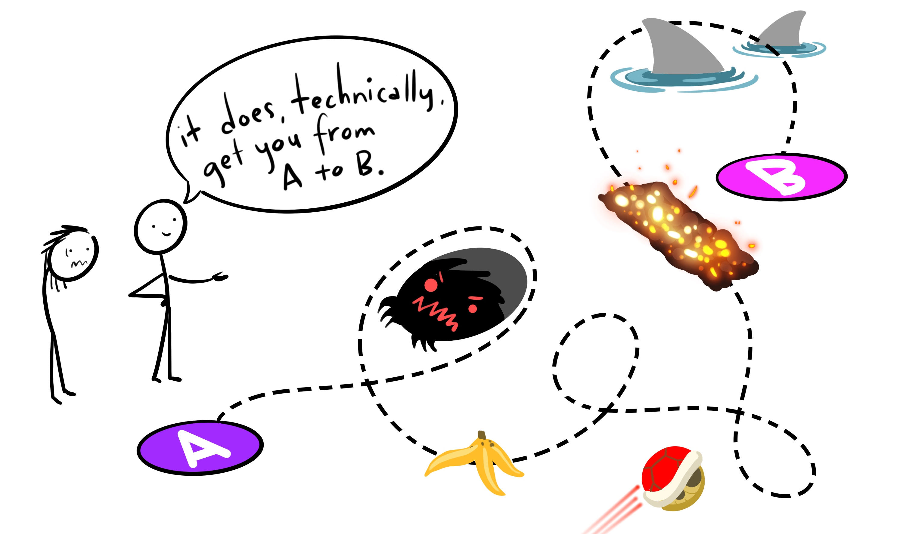
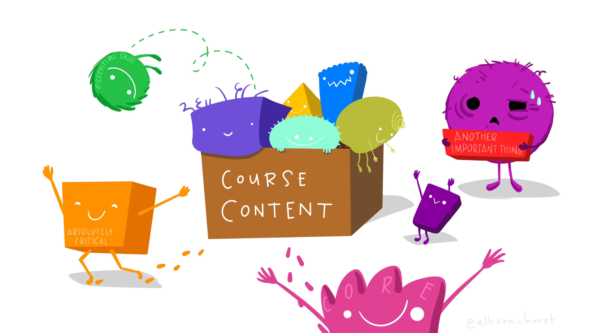

--- 
title: "PSYC193L"
author: "Ethan Hurwitz"
date: "`r Sys.Date()`"
site: bookdown::bookdown_site
documentclass: book
bibliography: [book.bib, packages.bib]
url: https://psyc193l.github.io
# cover-image: path to the social sharing image like images/cover.jpg
description: |
  Course material related to PSYC193L at UCSD.
biblio-style: apalike
csl: apa.csl
---

# Syllabus

## Basic Info

Psyc193L: Introduction to R for Social Sciences

Fall 2022

Warren Lecture Hall room 2113 (WLH2113)

*Lecture:* M/W 3:00pm-3:50pm (in-person)

*Lab:* F 3:00pm-3:50pm (on zoom [https://ucsd.zoom.us/j/94054557839](https://ucsd.zoom.us/j/94054557839))

## Course Description

  Whether in academia, industry, or clinical settings, if you are interested in social sciences or data science, you are going to have to work with data. You'll be using that data to perform analyses, make visualizations, and try to answer questions. Using programming languages and coding-based approaches are increasingly favored over GUI-based approaches (e.g., Excel, JMP, SPSS, etc.). The goal of this course is to provide an introduction to one such programming language, R.

## Course Objectives

There are 3 main sections of content in this course:

1. R Basics
2. Data Visualization
3. Data Manipulation and Cleaning


Along the way, you will learn how to use R to ...

* Import data for cleaning
* Wrangle and Prep data for analyzing
* Make publication-ready visualizations
  

Communicate what you have learned about your data ...

* In literate programming documents
* In an APA formatted written report


Contribute to open and reproducible science through ...

* Adopting good coding and project management practices
* Sharing your data and research reports online

This course is designed such that, by the end, you will be able to use R to successfully accomplish all the basic tasks you will have to do in other classes or lab volunteering. Content was chosen specifically based on what other students have mentioned they do most often.

## What Kind of Preparation Is Expected For This Course?

None! There are no prerequisites for this course, nor do you need to have any prior knowledge or experience with coding. However, if you have such experience, you may find it useful. 

## Instruction Team

**Professor**

Name: [Ethan Hurwitz](https://www.ethanhurwitz.com/)

Email: ehurwitz@ucsd.edu

Office Hours: By Appointment (contact me to schedule)

**Teaching Assistant**

Name: Alexis Smith-Flores

Email: assmith@ucsd.edu

## Course Structure

### Flipped Course Info

  No matter what, following along live coding synchronously is difficult. It helps to be able to pause or rewind when something is not clear and you need some more time to think. That obviously cannot be done while content is being conveyed live. Based on this, and feedback I have gotten from previous students, this course will utilize a flipped structure.
  
  Before each class, I will release online lecture notes as well as a recorded lecture where I cover the material. You can watch those and following along with the relevant files as you would in class synchronously. This allows you to get practice implementing the code as it is being introduced, but also be able to pause or rewind if needed. Classes will be treated as open office hours / study halls. You can ask questions about the lecture material, get live help, work through problems together, and make progress on assignments during class time!

### “Lecture” vs. “Lab” Sessions 

  While the official schedule of classes specifies separate “Lecture” and “Lab” sessions for the course, do not take this distinction too seriously. “Lecture” sessions will not consist exclusively of traditional lecture, and “Lab” sessions will not consist exclusively of traditional guided laboratory exercises. On any given day, you are likely to encounter some mix of brief lecture, group discussion, and/or hands-on activities.
  
## What Tools Will We Be Using In This Class?

All course materials are free. You have enough expenses, I am not interested in adding to them unnecessarily.

* **Computer with R and RStudio**
  + This is a programming course, it would be hard to get by without a computer! You will need to download R and RStudio.
  + You can download R [here](https://www.r-project.org/).
  + You can download RStudio [here](https://www.rstudio.com/products/rstudio/download/#download). You <u>must</u> download R **before** RStudio.
  + You can find a quick tutorial about getting R ready on your computer [here](http://web.cs.ucla.edu/~gulzar/rstudio/index.html).


* **Website**
  + You're looking at it right now! This website will functionally be the course textbook. This is where I will upload all lecture notes and information.


* **Canvas**
  + Canvas will be used for downloading and submitting assignments as well as grades.
  
  
<!-- * **[DataHub](https://datahub.ucsd.edu/hub/login)** -->
<!--   + Most of the R-based assignments will be completed through Jupyter notebooks on the UCSD  -->
<!-- DataHub website. -->
  
  
* **[Discord](https://discord.gg/nSVZVr3FMG)**
  + We will use Discord as a central place to manage questions about the class, communicate with each other, and easily copy/paste code for sharing. Checking the discord is an expected part of the class.

  
* **[Zoom](https://ucsd.zoom.us/j/94054557839)**
  + Office hours and some class periods will be held remotely via Zoom!
  
* **[Anonymous Feedback](https://forms.gle/WxLnmCbdgiKRqap89)**
  + This is a place to submit anonymous feedback to the teaching team.

## Grades

### What Are the Graded Assignments In This Class?

This class has **NO EXAMS**. Yes, that is right.

* Time constrained coding is not reflective of most real-world scenarios (at least those you'll initially find yourselves in).
* Exams would not do a good job of assessing whether you are learning what I want you to learn.

However, there must be ***some*** things to grade you on. They are the following:

<u>**Exercises (x10)**</u>

* Basic exercises that match up with lecture content applying the concepts/material being introduced.
  + The order of questions will almost always mirror the order of content in the notes/lectures. They are designed to be able to be completed in parallel.

  <!-- + Forces you to engage with the material while it is being presented and provides some grade buffer with easy points. -->

<u>**Practice Problem Sets (x9)**</u>

* Similar in format to the exercises.
  + Provides you an opportunity to practice applying new skills and ideas on your own, but still in a relatively directed way.
  + Also designed to mostly mirror the order of content in the notes/lectures.

<u>**Skills Challenges (x3)**</u>

* Each of the 3 main sections of content covered in this course has an accompanying Skills Challenge.
  + Skills Challenges will provide an opportunity to apply concepts in a "real-world" scenario.
  + They will also have some questions that are more abstract/conceptual, requiring you to really think about the data you are working with (similar to what you would be doing in a job/graduate program in Social Sciences).
  
<!-- <u>**Data Science Vignettes**</u> -->

<!-- * Completed towards the end of the course, these are brief case studies of actual data science projects undertaken in Social Science fields. These will be an opportunity to see how all the skills you have learned in this course can be directly applied in various fields of Social Sciences. -->
  
<!-- <u>**Feedback Forms**</u> -->

<!-- * This is a new course using all new material made largely from scratch. I am particularly interested in getting feedback on... everything! What works, what does not, what was engaging, what was boring, what was helpful, etc. There will be very brief feedback surveys about all the material that will be graded only for completion. -->

<u>**Final Project**</u>

Towards the end of this term you will write a complete research report in [APA format](https://owl.purdue.edu/owl/research_and_citation/apa_style/apa_formatting_and_style_guide/general_format.html) including a title page, abstract, introduction, methods, results, discussion, and references sections. There are two options for the project: one that is more directed and one that is more open.

For the <u>directed</u> option, you will choose a dataset that has specific questions that you must investigate and try to answer. For the <u>open</u> option, you will choose a dataset and come up with your own question(s) to investigate and try to answer. Datasets will be provided for you. You do not have to find or generate them on your own.

In both options, you will:

* Conduct a brief literature review to find sources which help motivate the research question(s) and provide rationale for your hypothesized answers to those questions.
* Clean/change/modify/whatever the data to get it in the form you need, then create visualizations and summary statistics that look for potential answers to your hypotheses.
* The paper will largely be explaining what you have done. 
  + What does the data contain? 
  + What are your questions? 
  + What are the possible answers? 
  + What are your predictions and why?
  + What would you expect to see if your predictions are accurate? If they are not accurate?
  + What did you do (explain your code in words)? 
  + Show the visualizations and summary statistics and explain/interpret them.
* The other thing you will do is create a literate programming document for your project. We will expound on this more later, but the code document you create will be thoroughly annotated for others' understanding.
* More information about this will be posted later.

<u>Paper Guidelines:</u>

* Must adhere to proper APA format
* Minimum of 3-4 pages of text (double spaced -- not including the space for figures/tables/etc.)
* Minimum of 3 references (you should probably have more though)
* Sufficiently motivate the question(s) and justify your hypotheses by what you find in your literature review. Describe and interpret your results mindfully.

<b>If you plan on using this paper to satisfy the Psychology B.S., Research Paper Requirement, your paper must adhere to the following guidelines:</b>

* At least <u>6 full pages of text</u> (double spaced, but must be text. Space taken up by charts, graphs, etc., does not count towards the 6 page minimum)
* At least 5 references, including a minimum of <u>3 empirical papers</u> (you should probably have more though)
* Discuss specific methodologies used in the lab or research articles cited
  + Specifically, you will have a more thorough introduction that reviews, in depth, the methodology typically used to study the topic of the dataset of your choice.
* Written clearly so a non-expert can follow the logic of what is being presented
* Demonstrate evidence of critical thinking about research (not summarizing what has been done)

<b><u>Note:</u></b> These are departmental guidelines, I have no say in this. This is what the department requires a Psychology B.S. Research Paper to have.

Again, you will be given optional datasets to choose from later on. You will <b>NOT</b> have to collect this data yourself!

### How Does Grading Work?

<!-- Summer Session Version:-->
<!-- Graded assignments will be downloaded and submitted on Canvas. For each assignment, you will submit a knit .html document and the source .Rmd document (more on this later). All assignments are due the Monday after they are introduced. i.e., anything released in Week 1 is due by Monday of Week 2, etc. -->

<!-- Regular Term Version:-->
Graded assignments will be downloaded and submitted on Canvas. For each assignment, you will submit a knit .html document and the source .Rmd document (more on this later). Submissions that do not include BOTH file types will be considered incomplete after week 1. <b>All assignments are due by Sunday at 11:59pm the week they are released i.e., anything released on Monday of Week 1 is due by that Sunday at 11:59pm (before Monday of Week 2), etc.</b> If you submit the Exercise assignment(s) for a given week by Wednesday at 11:59pm of that week, it will be graded with feedback by that Saturday at the latest. Thus, you will be able to use that feedback for the Practice Problem set on the same topic and potentially avoid making repeat errors across assignments. This is not required, and assignments will only be considered late if they are submitted after the Sunday at 11:59pm deadline.

This course is designed to facilitate your *engagement* and *effort* with the material. What is going to help you learn and develop R skills the most is to actually **practice doing** coding... a lot. It is thus, in my view, counter-productive to have a single heavily weighted assignment (exam) or for there to be high amounts of pressure to find some singularly correct answer to every problem.

In service of this, there will be no exams. Also, the Exercises, Practice Problem Sets, and Skills Challenges, will be graded 50% for completion and 50% for accuracy. To earn the completion portion of the credit, you must demonstrate that you were actually engaging with the material in a meaningful way and trying your best. You will not earn this credit by just copy/pasting the same bit of code, or writing, "I don't know," for each question. I **will** check this. Additionally, several questions on assignments do not have a singular correct answer. You only need to use the code accurately (which can often be done many ways)!

### Is Code Graded For Quality?

NO!

{width=100%}
<p style="font-size:6pt">Artwork by @allison_horst</p>

This is an intro course that assumes no prior knowledge. As long as your code ultimately gives you what you want, and you are not cheating or breaking any rules, it does not matter how circuitous or un-glamorous that code is!

### Grade Breakdown

The full grade breakdown is as follows:

```{r Grade Breakdown, echo=FALSE, message=F, warning=F}
library(tidyverse)
library(kableExtra)

# Summer Session Version:

# kbl(data.frame("Assignment" = c("Exercises",
#                                             "Practice Problem Sets",
#                                             "Skills Challenges",
#                                             "Final Project",
#                                             "Feedback Forms"), 
#                            "Total Percentage" = c("20", "20", "30", "25", "5")#,
#                            #"Breakdown" = c("<b>test</b>", "*test*", "**test**", "`test`")
#                            ), col.names = c("Assignment", "Total %")) %>%
#     #kableExtra::kable_paper("striped", full_width = T) %>%
#     #column_spec(5:7, bold = T) %>%
#     #kableExtra::row_spec(1, bold = T, color = "white", background = "grey")
#   #kable_material(c("striped", "hover"))
#     kable_styling(bootstrap_options = c("striped", "hover", "condensed", "responsive"), position = "center")

# Regular Term Version:

kbl(data.frame("Assignment" = c("Exercises",
                                            "Practice Problem Sets",
                                            "Skills Challenges",
                                            "Final Project"), 
                           "Total Percentage" = c("20", "20", "30", "30")#,
                           #"Breakdown" = c("<b>test</b>", "*test*", "**test**", "`test`")
                           ), col.names = c("Assignment", "Total %")) %>%
    #kableExtra::kable_paper("striped", full_width = T) %>%
    #column_spec(5:7, bold = T) %>%
    #kableExtra::row_spec(1, bold = T, color = "white", background = "grey")
  #kable_material(c("striped", "hover"))
    kable_styling(bootstrap_options = c("striped", "hover", "condensed", "responsive"), position = "center")
```

Final letter grades in the course will be assigned according to the following percentage scale: 

```{r Grade Range, echo=FALSE, message=F, warning=F}
kbl(data.frame("A" = c("A+", "A", "A-"), 
                           "A2" = c("TBD", "93.00+ ", "90.00-92.99"),
                           "B" = c("B+", "B", "B-"),
                           "B2" = c("87.00-89.99",
                                    "83.00-86.99",
                                    "80.00-82.99"),
                           "C" = c("C+", "C", "C-"),
                           "C2" = c("77.00-79.99",
                                    "73.00-76.99",
                                    "70.00-72.99"),
                           "Other" = c("D", "F", ""),
                           "Other2" = c("60.00-69.99",
                                        "00.00-59.99",
                                        "")), col.names = NULL) %>%
    #kableExtra::kable_paper("striped", full_width = T) %>%
    #column_spec(5:7, bold = T) %>%
    #kableExtra::row_spec(1, bold = T, color = "white", background = "grey")
  #kable_material(c("striped", "hover"))
    kable_styling(bootstrap_options = c("striped", "hover", "condensed", "responsive"), position = "center")
```

  Grades will be rounded to the nearest hundredth of a point and the stated letter grade cutoffs will be applied without exception. There is no plan to "curve" grades in this course. Your instructor reserves the right to adjust all students’ grades up by a set value if deemed appropriate, and grades will not be adjusted down under any circumstances. At the end of the term, I will determine whether/how to award A+ grades for outstanding performance.

  <!-- To earn an A+ in this course, you must do work of truly outstanding quality. A+ grades will be awarded at my discretion (there is no set grade percentage to earn this grade).  -->

## Course Policies and Other Info

### Attendance

<!-- Summer Session Version: -->
  <!-- Attendance is <u>strongly encouraged</u>, and the decision to hold the course remotely was made in order to maximize the ability for students to attend synchronously, but is not required. Participation is based on activity completion, which can be completed asynchronously. However, it is much more difficult to do so this way. -->
  
<!-- Regular Term Version: -->
Attendance is <u>strongly encouraged</u>, but is <b>not required</b>. Lectures are flipped and there are no class participation credits. Thus, the course can be completed asynchronously. However, it is invariably the case that students who regularly attend class meetings attain the highest grades in this course.

### Late Work

<!-- Summer Session Version: -->
<!-- Assignments can be submitted up to 5 days past their due date for late credit. The late penalty for assignments is 10% per day late, capping out at 50% (5 days late). This applies to all assignments <b><u>except the paper and those in the final week</u></b>. -->

<!-- There may be some instances where it is better for you to take the late penalty than submit an incomplete assignment (e.g., the more incomplete an assignment, the better to take the late penalty). -->

<!-- Please do not let this flexibility encourage you to submit work late, because it is <b>*VERY*</b> easy to get behind on assignments given the pace of a Summer course. You can quickly find yourself with many assignments accruing high late penalties which have a significant impact on your overall course grade. Instead, you should view this as a built in accommodation for some unforeseen circumstances. -->

<!-- Regular Term Version: -->
Exercises, Practice Problem Sets, and Challenges, can be submitted up to 5 days past their due date for late credit. The late penalty is 10% per day late, and will only be accepted up to 5 days past the due date (i.e., Friday of the following week). <b><u>The paper/project CANNOT be submitted late</u></b>.

### Extensions

<!-- Summer Session Version: -->
<!-- Assignments have due dates that give you a fair amount of time to complete them. Granted, it is a Summer Session course, so things move at an accelerated pace. That said, I am a pretty reasonable person and will grant extensions under *reasonable* circumstances (being stressed will not warrant an extension). Please reach out to me if you are struggling or any unique situations arise. -->

<!-- Regular Term Version: -->
  Assignments have due dates that afford a lot amount of time to complete them, and should be able to accommodate instances where you get sick or something else comes up. However, each student will have one "emergency button" they can push. You can use an emergency button to remove the late penalty on any week's assignments. If something comes up and you must submit assignments late, you can push your "emergency button" and submit it up to 5 days late with no late penalty. This is something you can only do **once** all quarter, and must let me know explicitly when/if you use it!
  
Please reach out to me if you are struggling or any unique situations arise.

### Email/Discord DMs

  If you would prefer to ask a question privately,<!-- you may DM me on Zoom,--> email me, send me a DM on discord, or come to my office hours. My preference would be a <!--Zoom DM or--> Discord DM, as I will check those more frequently. If you choose to email, please include “PSYC 193L” in the subject line of your emails. Doing this will make sure I see your message in a timely manner. 
  
### Academic Integrity

  All students are expected to adhere to standards of academic integrity. Cheating of any kind on any assignment will not be tolerated. It is disrespectful to your peers, the university, and to me. Especially considering this course is designed with a grading scheme that rewards effort and engagement and does not disproportionately favor correctness.

  If you are unsure what might constitute a violation of academic integrity, consult me and/or the [UCSD website on academic integrity](http://academicintegrity.ucsd.edu). Any evidence of academic misconduct will be reported to the Academic Integrity Office. Consequences for academic misconduct may include a failing grade in the course and official action by the University. <u>**Please, do not make me have to do this.**</u> If you are struggling with the course content or anything else, **reach out to me**.  

### OSD Accommodations

  Any student with a documented disability will be accommodated according to University policy. For details, please consult the Office of [Students with Disabilities (OSD)](http://disabilities.ucsd.edu). If you require accommodation for any component of the course, please provide me with documentation from OSD as soon as possible. ***Please note that accommodations cannot be made retroactively under any circumstances***. For example, if you submit a Skills Challenge and afterward provide documentation that you require extra time, you will receive accommodation only on subsequent assignments and not on the one that you have already taken. 

### Extra Credit

  You may earn up to 2 points of extra credit which will be added to your overall grade in the course. One of those points can be earned by completing SONA participation credits (worth 0.25 points each). To sign up for an experiment, go to the [SONA website](https://ucsd.sona-systems.com). To earn the full point of extra credit in the class, you must complete 2 SONA credits.
 
  The second extra credit point can be earned by completing the CAPEs for our course as well as an additional survey sent out at the end of the quarter. If 80% of the class completes both surveys, the entire class will earn 1 extra credit point. 

## What We Expect From You

### Values We Share:

  We are genuinely committed to equality, diversity, and inclusion in this course. Consistent with the [UC San Diego Principles of Community](https://ucsd.edu/about/principles.html), we aim to provide an intellectual environment that is at once welcoming, nurturing and challenging, and that respects the full spectrum of human diversity in race, ethnicity, gender identity, age, socioeconomic status, national origin, sexual orientation, disability, and religion. We sincerely hope that you will share our commitment to actively creating and maintaining a safe environment founded on mutual respect and support. To be clear, this course affirms people of all gender expressions and gender identities. If you prefer to be called a different name than what is indicated on the class roster, please let me know. Feel free to correct me on your preferred gender pronoun. If you have any questions or concerns, please do not hesitate to contact me.

### Code of Conduct:

  You do not need to become friends with all of your fellow students in class, but you are expected to treat me and them with courtesy and respect. This class should be a harassment-free learning experience for everyone regardless of gender, gender identity and expression, sexual orientation, disability, physical appearance, body size, race, age, or religion. Harassment of any form will not be tolerated. If someone makes you or anyone else feel unsafe or unwelcome, please report it to me as soon as possible. If you are not comfortable approaching me, you may also contact the [UC San Diego Office of the Ombuds](https://ombuds.ucsd.edu/).

## What Will We Learn?

<!-- This is a new course and when designing a new course there is a lot of content you could potentially cover! -->

<!-- {width=100%} -->
<!-- <p style="font-size:6pt">Artwork by @allison_horst</p> -->

In choosing what content to include, this was my philosophy:

* I wanted to spend more time practicing a few skills so they could be deeply learned, rather than cover a broader array of material with less depth.
  + Focusing on a narrower amount of content affords more practice time with that content and better learning.
* I decided to focus on the skills and things you are most likely to be applying soon after this class
* I spoke with students who have come out of my other R classes, asked them:
  1. What do they do/use most often?
  2. What do they wish they had learned?
  3. Showed them some things I considered including and asked if they thought it would have been helpful.
* The answers to these questions helped me determine what content to include in this class.
* I am always happy to chat about things outside the scope of course content! In office hours or email/discord/whatever.

	<!-- - Brief overview of what we’ll cover -->
	<!-- - Philosophy / reasoning on why and how I’ve chosen what I’ve chosen. -->
	<!-- 	- Want to spend more time practicing a few things to deeply learn them rather than cover a broader array of material with less depth -->
	<!-- 	- Decided to focus on the skills and things you are most likely to be applying soon after this class -->
	<!-- 	- Talked with students who have come out of my other R classes, asked them 1. What do they do/use most often, 2. What do they wish they had learned, 3. Showed them some things I considered including and asked if they thought it would have been helpful. -->
	<!-- 	- Whereas most Social Psychology courses involve material that requires declarative knowledge, or the knowledge about facts, this course requires procedural knowledge. Learning programming is like learning a language, because it literally **is** learning a language. When you're learning to drive, you can't just read about different driving tips and best practices, you have to actually go out and get behind a wheel and practice. It requires procedural knowledge. With that in mind, focusing on a narrower amount of content affords more practice with that content and better learning. -->
	<!-- 	- Always happy to chat about things outside the scope of course content! In office hours or email/discord/whatever -->
		
## Schedule

The schedule below is tentative and subject to change.

<!-- ```{r Summer Schedule, echo=FALSE, message=F, warning=F} -->
<!-- kbl(data.frame("Week" = c("1", "2", "3", "4", "5"),  -->
<!--                            "Monday" = c("Syllabus", "Different Graph Types", -->
<!--                                                  "Viz Challenge<br>+Project Intro", -->
<!--                                                  "Summarizing", ""), -->
<!--                            "Tuesday" = c("Why use R<br>+Coding Basics<br>+Using R Effectively",  -->
<!--                                          "Different Graph Types",  -->
<!--                                          "Tidy Data<br>+Control Flow",  -->
<!--                                          "Wrangling<br>Challenge", ""), -->
<!--                            "Wednesday" = c("R Basics<br>Assignments", -->
<!--                                            "ggplot<br>Customization", "Basic<br>Wrangling",  -->
<!--                                            "Data<br>Transformation",  -->
<!--                                            ""), -->
<!--                            "Thursday" = c("ggplot Intro", -->
<!--                                     "Color<br>Theory", -->
<!--                                     "Advanced<br>+Wrangling", -->
<!--                                     "RStudio Projects<br>+Project Mtg", "")),  -->
<!--     escape = FALSE, align = "c") %>% -->
<!--     #kableExtra::kable_paper("striped", full_width = T) %>% -->
<!--     #column_spec(5:7, bold = T) %>% -->
<!--     #kableExtra::row_spec(1, bold = T, color = "white", background = "grey") -->
<!--   #kable_material(c("striped", "hover")) -->
<!--     kable_styling(bootstrap_options = c("striped", "hover", "condensed", "responsive"), position = "center") -->
<!-- ``` -->


```{r AY Schedule, echo=FALSE, message=F, warning=F}
kbl(data.frame("Week" = c("1", "2", "3", "4", "5", "6", "7", "8", "9", "10"), 
                           "Topic" = c("Why Use R?<br>Coding Basics<br>Using R Effectively<br>R Basics Challenge", 
                                       "Intro to ggplot",
                                                 "geoms and graph types",
                                                 "ggplot Customization<br>Color Theory",
                                       "Data Viz Challenge",
                                       "Control Flow<br>Transformations",
                                       "Basic Wrangling",
                                       "Advanced Wrangling<br>Summarizing",
                                       "Data Manipulation Challenge",
                                       "Projects")), 
    escape = FALSE, align = "c") %>%
    #kableExtra::kable_paper("striped", full_width = T) %>%
    #column_spec(5:7, bold = T) %>%
    #kableExtra::row_spec(1, bold = T, color = "white", background = "grey")
  #kable_material(c("striped", "hover"))
    kable_styling(bootstrap_options = c("striped", "hover", "condensed", "responsive"), position = "center")
```

## Words of Advice

Learning a new language, particularly a programming language, can be frustrating at times!

{width=100%}
<p style="font-size:6pt">Artwork by @allison_horst</p>

It is truly a roller coaster. With time, effort, and perseverance,<!-- and maybe some wine/Beyoncè playlists,--> you will be surprised at how much you know and are able to do (and how much *more* you can learn and do)!

{width=100%}
<p style="font-size:6pt">Artwork by @allison_horst</p>

### Feedback From Previous Students:

Don't just take my word for it! Here are some suggestions and advice from students who took this course previously:


* "When going into this class, don't over think or complicate things. If you find yourself in this situation and taking too long on the assignments, ask for help! I thought it was embarrassing asking for help in the beginning, but I benefited greatly from it. Also, stay on top of the assignments because its easy to fall behind. I recommend not waiting till the day it's due. Finally, it's better to turn in an assignment a day late and completed rather than rushed or not at all."

* "Make sure to utilize the lecture notes while watching lectures and doing the assignments! There is a lot of material for this class, but it becomes easier once you realize that most of the exercises and assignments are based around the notes."

## How to be Successful in this Course:

1. Learn how to troubleshoot things on your own. This entails learning how to google and how to debug. This is NOT because we don’t want to help you, but because the most impactful learning can come when you solve a problem yourself.

2. Do not hesitate to ask questions or for help! If you try to solely struggle alone, it will often not work out well. Ask the teaching team or your classmates questions. 

3. Pay attention. It should be obvious but if you do not come prepared to learn and pay attention, it will be really difficult for you.

4. Practice. Again, this is a skill. You cannot learn R effectively by just reading instructional material. You have to actually do it yourself. Write shitty code, have it fail, see what went wrong, read the error messages, and then write better code. 

5. Try to keep a good mindset. Acknowledge that this is challenging, but is not impossible, that you have help available and know what our expectations are for you.

6. Be proactive. <!--This is a Summer Session course, and we will be moving very quickly through material.--> If you constantly wait until the last minute to do things, you run the risk of not only just missing work, but falling behind and having trouble being able to catch up.

## Acknowledgements

I'd like to directly thank [Emma Geller](https://www.lime-lab-ucsd.com/people) (endlessly), [Judy Fan](https://cogtoolslab.github.io/people.html), and Angela Lowe, for sharing their syllabi materials, teaching philosophy, and mentorship.<!--, and [Natalia Pallis-Hassani](https://www.linkedin.com/in/natalia-pallis-hassani-865ba3193) for feedback in developing course material.--> Throughout this course, I will use many illustrations created by the brilliant [Allison Horst](https://www.allisonhorst.com/).

## References
